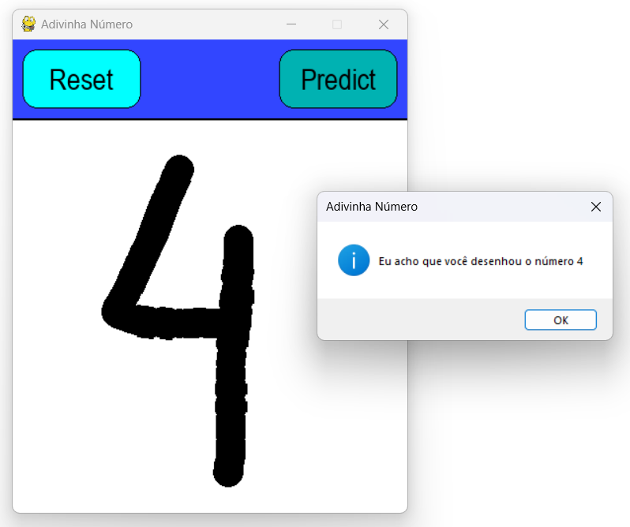
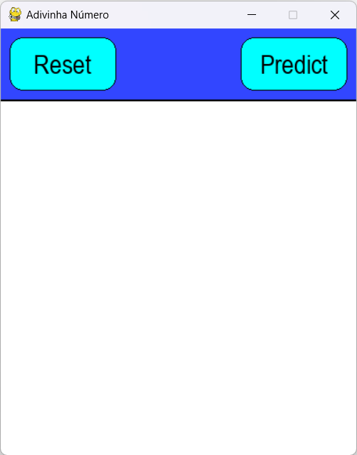
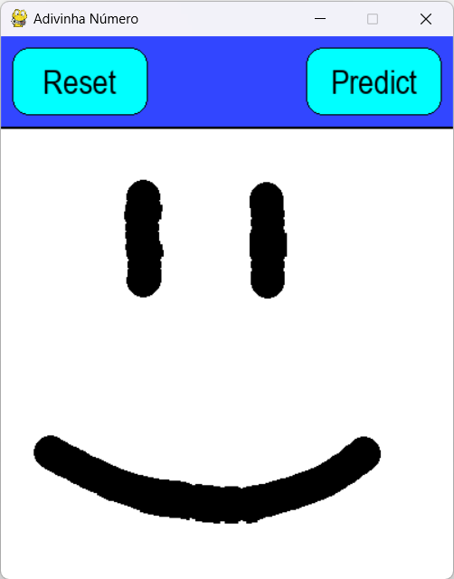

# Projeto Classificador de Números

## Resumo
Projeto pessoal de machine learning que consiste em classificar um algarismo escrito pelo usuário, ou seja dizer que número é de 0 a 9.
Os dados de treino foram desenhados por mim e guardados nos arquivos *data/data.npy* e *data/labels.npy*, que foram usados para treinar um modelo
SVM (Support Vector Machine), mais especificamente, o SVC (C-Support Vector Classification). 

## Objetivo
O objetivo desse projeto é conhecer e ganhar um pouco de experiência prática em algumas das bibliotecas mais usadas em python como numpy, matplotlib, scikit-learn e opencv-python.

## Como rodar

### Pré-requisitos
- Ter python instalado
- Ter git instalado

Siga os seguintes passos para rodar o projeto:
1. Clonar o repositório
```console
git clone https://github.com/Kilezico/classificador-numeros.git
cd classificador-numeros/
```
2. Criar um ambiente virtual python
```console
python -m venv ./venv
./venv/Scripts/activate
```
3. Atualizar o pip e baixar as dependências
```console
python -m pip install --upgrade pip
pip install -r requirements.txt
```
4. Rodar o programa
```console
python app.py
```

## Como usar
Com o programa aberto, basta desenhar na áera branca com o mouse. \
Clique no botão "Reset" ou pressione 'R' para apagar a tela. \
Clique no botão "Predict" ou pressione 'S' para classificar o desenho.



## Conclusão
O projeto ainda não está perfeito: o modelo nem sempre acerta os números (especialmente se desenhados muito pequenos ou parecidos com outros), mas foi um bom jeito para introduzir o
conceito de machine learning para mim e também aprender um pouco sobre técnicas de manipulação de imagens em OpenCV, como Crop, Resize, etc.
\
\
Ainda tenho algumas ideias de como melhorar a acurácia do modelo, como treiná-lo com imagens de resolução maior, centralizar mais os 
desenhos através de crops, tanto no treino quanto na classificação, e também variar mais os dados, por exemplo deixando outras pessoas, com caligrafias
diferentes, desenhar números para o treino também, deixando o modelo mais abrangente.
\
\
Planejo algum dia implementar essas ideias que tive para tentar conseguir um resultado melhor, mas por enquanto, estou feliz com o resultado que obtive.

